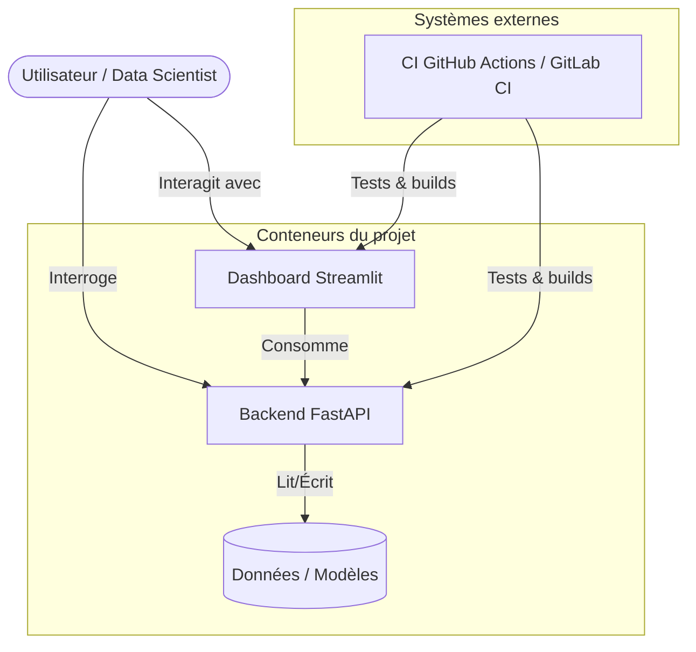

# 🏗️ Architecture : Titanic ML

Ce document donne une vue d'ensemble de l'architecture, des interactions entre composants
et des choix techniques du projet **Titanic ML**.

---

## 🗺️ Vue d'ensemble

Le projet suit une architecture modulaire pensée pour la scalabilité, la maintenabilité et
une séparation claire des responsabilités. Il fait le pont entre la recherche Data Science
et un service prêt pour la production.

### Diagramme de conteneurs (C4 niveau 2)

---

## 📦 Composants

### 1. `src/titanic_ml/core` (logique métier)
Le cœur du projet, indépendant du mécanisme de livraison (API ou app).

| Module | Responsabilité |
| :--- | :--- |
| `data_io/` | Chargement du dataset Titanic (téléchargement + cache local). |
| `features/` | Sélection des features et pipeline de préprocessing (imputation, encodage, scaling). |
| `models/` | Construction, entraînement et évaluation du modèle (`RandomForestClassifier`). |
| `utils/` | Chemins centralisés (`paths.py`) et version du projet (`version.py`). |
| `visualization/` | Réservé aux futures fonctions de visualisation réutilisables. |

### 2. `app/` (Frontend)
Construit avec **Streamlit**, cette couche fournit une interface d'exploration de données :
- Téléversement et exploration de n'importe quel dataset (dont `data/raw/titanic.csv`).
- Statistiques et aperçu interactif via Pygwalker.

### 3. `src/titanic_ml/api/` (Backend)
Construit avec **FastAPI**, cette couche expose des routes REST :
- **Documentée** : documentation Swagger/OpenAPI automatique sur `/docs`.
- **Découplée** : d'autres systèmes peuvent consommer l'API sans connaître l'implémentation interne.
- Routes actuelles : `/health`, `/version`, `/base/`, `/hello`, `/bonjour` (squelette générique,
  à enrichir avec un endpoint `/predict` consommant le modèle entraîné).

---

## 🔄 Flux de données

1. **Ingestion** : `titanic_ml.core.data_io.loader.load_data()` télécharge le CSV dans `data/raw/`.
2. **Préparation** : `titanic_ml.core.features.preprocessing` sélectionne les colonnes et construit
   le pipeline scikit-learn (imputation, scaling, one-hot encoding).
3. **Entraînement** : `titanic_ml.core.models.train` entraîne un `RandomForestClassifier` et sauvegarde
   le modèle dans `models/titanic_model.joblib`.
4. **Évaluation** : `titanic_ml.core.models.evaluate` calcule les métriques et sauvegarde la matrice de
   confusion dans `docs/figures/`.
5. **Consommation** :
   - **Hors-ligne** : `scripts/train_pipeline.py` exécute le pipeline complet, ou notebooks dans `notebooks/`.
   - **En ligne** : l'API (`titanic_ml.api`) pourrait charger le modèle et servir des prédictions ;
     Streamlit (`app/`) affiche les données et résultats.

> [!IMPORTANT]
> **Versioning des données (DVC)** : pour des datasets > 10 Mo, il est recommandé d'initialiser
> [DVC](https://dvc.org/) (`dvc init`) plutôt que de committer les fichiers directement dans Git.

---

## 🛠️ Stack technique

- **[uv](https://github.com/astral-sh/uv)** : gestion unifiée des versions Python et des dépendances.
- **[Ruff](https://github.com/astral-sh/ruff)** : lint + format en un seul outil.
- **[Dockerfile multi-stage](dockerfiles/Dockerfile)** : image optimisée séparant build et runtime.
- **[Pytest](https://docs.pytest.org/)** avec couverture de code (seuil 80 %).
- **[mypy](https://mypy-lang.org/)** en mode strict pour la sûreté des types.

---

## 📈 Scalabilité

La séparation entre `src` (logique) et `api`/`app` (interfaces) permet, si le projet grandit, de :
- Déployer l'API comme service Kubernetes autonome.
- Réutiliser la logique cœur dans des frameworks de traitement distribué.
- Étendre le frontend sans toucher aux pipelines de données sous-jacents.
